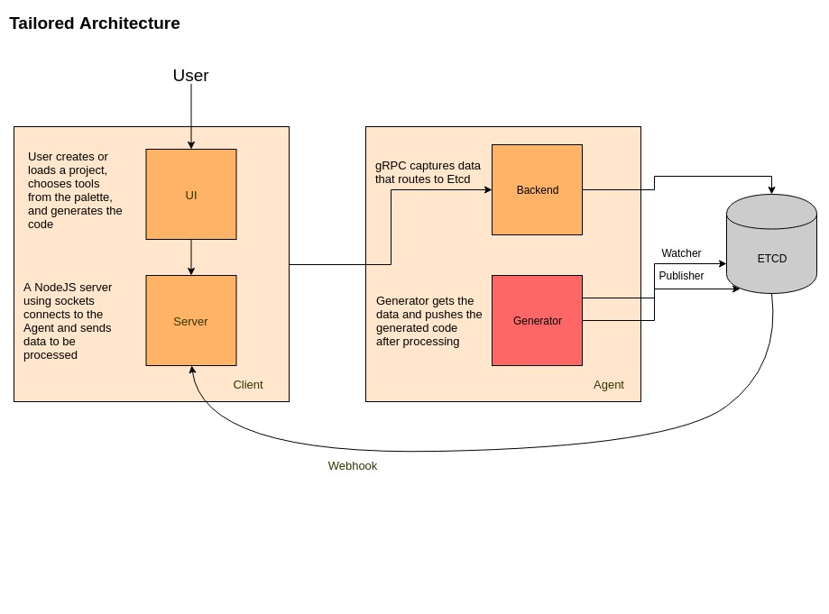

# Tailored

Tailored is full-stack web application for generating configurable front-end tooling integrations to make development a breeze. The user is able to select from available tools and generate working template code to be immediately usable in an application.

## :wrench: Architecture

    

## Installation

_TODO_

## Documentation

_TODO_

## Contributing

If you are interested in contributing, please see the contribution guidelines (_TODO_).